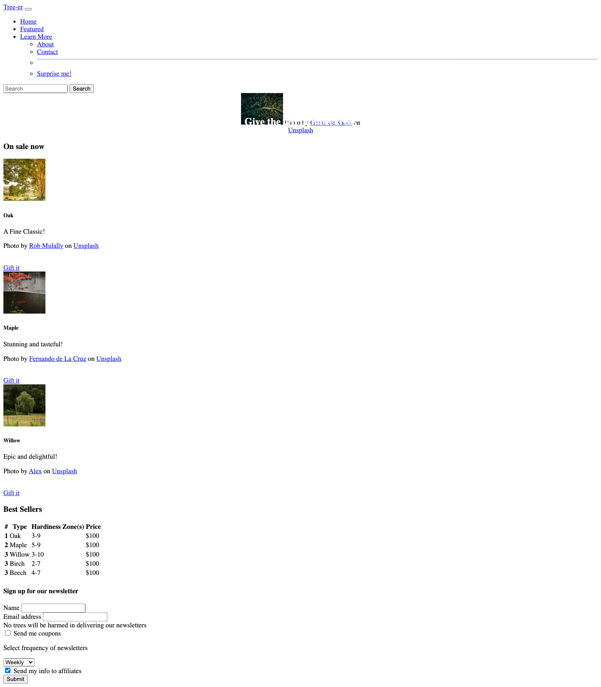
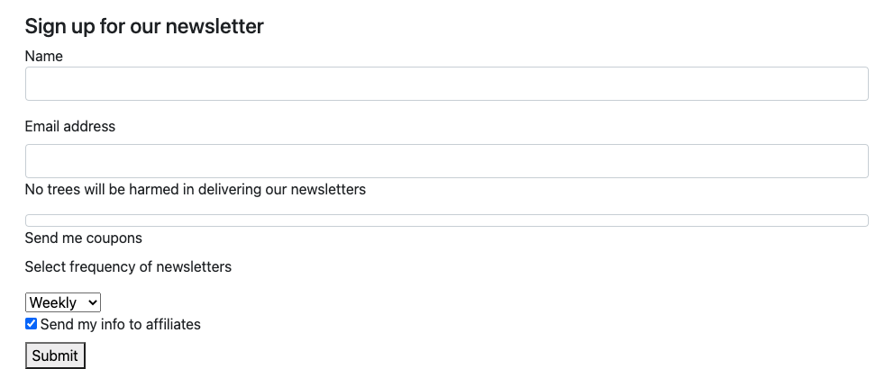

# CSS Bootstrap

## Code Libraries and Frameworks

Oftentimes, developers find that they have the same problems in many projects.

When it comes to CSS, a number of problems happen over and over again. For example:
- Consistency across browsers
- Making a responsive/mobile and desktop version
- Styling forms to look more modern and user friendly

Rather than each developer coding their own solution and using it over and over again, developers get together and make a code library or framework.

One popular CSS framework is called Bootstrap. It was initially developed at twitter and was made open source in 2011. As an open source project, anyone can use these code solutions for free and they can also contribute to improving the project.

## Shifting Strategies

While a base understanding of CSS is critical in building websites, in order to get the most out of a code library/framework is the ability to read the documentation and learn to use the built-in features.

[Bootstrap's documentation](https://getbootstrap.com/docs/5.0/getting-started/introduction/) is quite good. As you look through it, you will see that it has many features. The more you build with it, the more you'll learn. Today we'll focus on getting set up and looking at some basic features.

## Get coding: Get the starter code

We'll be building Tree-er. The html is complete all we have to do is add the bootstrap code library and apply the appropriate classes.


..
..
..

Starting appearance



## Pro-tip

Our HTML is quite long and busy. When we work on sections we can visually fold up our code with our text editor.


This will make it easier to stay focused on the component we need to style.


## Getting started

There are a few ways to get Bootstrap into your project. We'll start with just adding a `link` tag. This tag works just like any css you'd write yourself. It is hosted elsewhere on the internet, but it will bring in all the code.
[Get the link](https://getbootstrap.com/docs/5.0/getting-started/introduction/)

Looks like this:

`<link href="https://cdn.jsdelivr.net/npm/bootstrap@5.0.0-beta1/dist/css/bootstrap.min.css" rel="stylesheet" integrity="sha384-giJF6kkoqNQ00vy+HMDP7azOuL0xtbfIcaT9wjKHr8RbDVddVHyTfAAsrekwKmP1" crossorigin="anonymous">`


Paste it inside the `head` tag of the `index.html`

**Note**: when loading more than one css file, it is treated as one long file. Therefore the file that comes last 'wins' if there are the same selectors altering a particular style. Therefore, Bootstrap should come first, then your personal styles should come later. So, make sure your Bootstrap link is above the link for `main.css`

Further, there are more ways to customize bootstrap, but we won't cover it today.


The most notable thing will be that the font has changed.

## Hero

Let's style the main image. It is sometimes referred to as a `hero`, `jumbo` or `jumbotron`image.

Below the `nav`, there is a div with an `id` of hero. Let's add the appropriate class: `container-fluid` - this will make the image stretch 100% of the page, no matter the width.

```html
  <div class="container-fluid" id="hero">
```
Next, in the img inside of that div, add the class `img-fluid` - this will also keep the image at 100% width.

```html
  
```

## On Sale Now

Move down to the `div` that contains the `h3` that reads `On Sale Now` and add the class `container` - When the width is below a certain amount of pixels, the display will be a wider percentage, when the browser is wider, there will be more space around the sides of the container.

Let's add a class to the `h3` to style it more as a display. Generally, text on a web page serves two purposes - as a title/display eye-catching part of the page, or as text that is meant for easy reading. Adding the class `display-4` will increase the size of the font of the `h3`

## A Row of Cards

If we go back to our starter image we have a row of 3 cards. Let's set up the div that contains these cards as a row.

```html
<div class="row">
```

We then have three cards that we need to add the same styles

- The outer div will be `card col`
- The image inside `card` will be `card-img-top`
- The next div will be `card-body` inside the `card-body`
  - `h5` with a class `card-title`
  - `p` with a class of `card-text`
  - `a` with two classes `btn` and `btn-primary`

  ```html
  <div class="row">
    <div class="card col" style="width: 18rem;">
      
      <div class="card-body">
        <h5 class="card-title">Oak</h5>
        <p class="card-text">A Fine Classic!</p>
        <p>
          <span>Photo by <a href="https://unsplash.com/@robmulally?utm_source=unsplash&amp;utm_medium=referral&amp;utm_content=creditCopyText">Rob Mulally</a> on <a href="https://unsplash.com/s/photos/oak?utm_source=unsplash&amp;utm_medium=referral&amp;utm_content=creditCopyText">Unsplash</a></span>
        </p>
        <br/>
        <a href="#" class="btn btn-primary">Gift it</a>
      </div>
    </div>
  ```


The remaining two cards have had the same classes applied in the interest of time.


## Styling a Table

Scroll down to the `table`

For certain elements, like `tables`, despite already being a `table` element, you still have to use a class to opt in to Bootstrap's table styling.  You will find this true  for `button`s and other elements as well.

```html
  <table class="table">
```

Let's add another class `table-striped` that will allow for better differentiation between rows

```html
  <table class="table table-striped">
```

If we want to center the text elements in our table, we could write our own `css` in the `main.css` file. But it is better to use bootstrap, whenever possible. Bootstrap has a class called `text-center` that will center our text. This will allow for more consistent styling and less unexpected behaviors with our styles.

```html
  <table class="table table-striped table-hover text-center">
```

Finally, we can imagine that each row would be a link to an individual view of each tree with more information and the ability to purchase it. To assist our users in navigating the site we can add a hover effect.

```html
  <table class="table table-striped table-hover text-center table-hover">
```


## Styling the Form

Below the table, let's add a `class` of `container` to the `div`

In the first two  `div`s inside the `form`, add the class `mb-3`- this will add some bottom margins.


### Text Inputs

Add the class `form-label` to the two labels inside the form.

For the two text inputs, add the class `form-control`

This should update our form to look like this:



### Form Checkbox

Add the classes `mb-3 form-check` to style the div that contains the input with type checkbox.

For the input with the type `checkbox` add a class `form-check-ionput`

For the label add the class `form-label`

### Form Select/Options

In the `select` element, add the class `form-select`


### Checkbox 2 - Style as a Switch

Add the classes `form-check form-switch` to the div that contains an input with type `checkbox`


For the final input with type `checkbox` add the classes `form-check-input`

Finally, let's style the submit button by adding the classes `btn btn-primary`


## Bonus

You'll see in the `main.css` file that the `nav` `display` is set to `none`. Remove that code and go back to the mockup image. Use the Bootstrap documentation to get it styled like the mockup.
